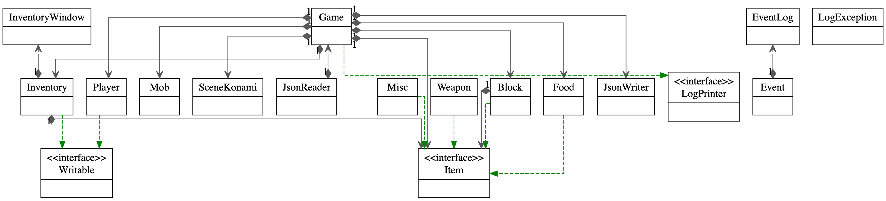

# My Personal Project

## 12 Minutes.

- What will the application **do**?

The application will be a minimalist text-based
adventure game that allows players to make choices
and interact with the story using button-based
interactions.

**Start**: The player wakes up in an unfamiliar place with
no memory of how they got there. They quickly realize
that they are in a time loop and must find a way to break
free.

**Early Progress**: The player explores the area and finds
objects and clues that will help them understand the 
situation and find a way to escape the time loop. As they
progress, the player begins to notice patterns and 
realizes that the time loop happens every 12 minutes 
(1 game day).

**Mid-game**: The player starts to uncover more details
about the time loop, such as what triggers it and who 
or what is behind it. They use this knowledge to try 
different approaches to break the loop and to avoid
making the same mistakes over and over again.

**End-game**: The player makes a breakthrough and 
discovers the key to breaking the time loop. The player's
choices and actions determine whether they are able
to break free and what the outcome of the game will be.

Throughout the game, the player must balance 
their resource management and puzzle solving to 
progress and escape the time loop. Most interactions 
will lack dialogues and exposition. The story will 
rely on environment cues. The gradual 
uncovering of the story and the player's sense of 
urgency to escape the loop add to the suspense and 
challenge of the game.

This is heavily inspired by games such as 
**A Dark Room**, **Minecraft**, and **CandyBox**.

- **Who** will use it?

The application will be used by people who enjoy 
text-based adventure games and are looking for a 
unique and immersive gaming experience. It will also
be suitable for people who appreciate minimalistic 
design and enjoy games that allow them to make 
choices and affect the outcome of the story.

- Why is this project of *interest* to **you**?

This project is of interest to me because I have a 
passion for creating interactive and engaging gaming 
experiences. I am also interested in minimalistic 
design and the concept of creating a unique 
experience for each player through multiple endings. 
Additionally, I believe text-based adventure games 
are an underappreciated genre, and I am excited to 
contribute to its resurgence in popularity.

## User Stories
- As a user, I want to be able to add items to my inventory
- As a user, I want to be able to remove items from my inventory
- As a user, I want to be able to craft recipes from my inventory items
- As a user, I want to be able to kill enemies
- As a user, I want to be able to eat food 
- As a user, I want to be able to view a list of my current items in inventory
- As a user, I want to be able to save my current progress as inventory and player stats
- As a user, I want to be able to load my previous progress as inventory and player stats
- As a user, I want to be able to interact with entities (NPCs) via given options
- As a user, I want to be able to interact with miscellaneous items in my inventory
- As a user, I want to be able to change the display mode of the game (light mode/dark mode)
- As a user, I want to be able to change the sound option (mute/sound on)
- As a user, I want to be able to view buttons I cannot click due to lack of experience or items
- As a user, I want to be able to load my previous game progress

## Instructions for grader
- To generate the action of adding X's (wood) to a Y (inventory) select the to "Leave" the talk with the guard and then
 select "Go north" and then "Chop wood".
- To view the added X (wood or wooden Plank), click "Open inventory" which opens a new window to showcase the current
 inventory.
- To perform the action of selecting the current item, click on one of the items and then click done.
- The current item is displayed on the player panel.
- You can save the state of the inventory by clicking on the "save" button on the top right-hand side of the player
 panel.
- You can reload the state of the inventory by clicking "Load game" at the start menu
- The visual component of my application is the background of the game

## Phase 4: Task 2

An example of what the logs look like at the end of the program is given below.

`Wed Apr 12 16:28:24 PDT 2023
Added item: Raw Meat to inventory.`

`Wed Apr 12 16:28:24 PDT 2023
Removed 1 item(s): Raw Meat from inventory.`

`Wed Apr 12 16:28:34 PDT 2023
Set current item to: Wooden Planks.`

`Wed Apr 12 16:28:55 PDT 2023
Set current item to: Wooden Sword.`

`Wed Apr 12 16:28:56 PDT 2023
Added item: Wooden Planks to inventory.`

`Wed Apr 12 16:29:15 PDT 2023
Set current item to: Wooden Sword.`

`Wed Apr 12 16:30:01 PDT 2023
Added item: Gold to inventory.`

`Wed Apr 12 16:30:01 PDT 2023
Set current item to: Gold.`
`

## Phase 4: Task 3

*UML diagram*

Given the resources, I would implement the following ideas into my code:
- Refactoring the GUI into smaller, more cohesive classes helps to increase maintainability and extendability by
  separating responsibilities and making modifications to one class independent of the rest.

- Creating more methods with a single responsibility and purpose to help increase the readability and maintainability
  of the code.

- Using more abstract classes and interfaces to reduce repeated code and provide a common structure for multiple
  classes to implement, resulting in more efficient and modular code.
